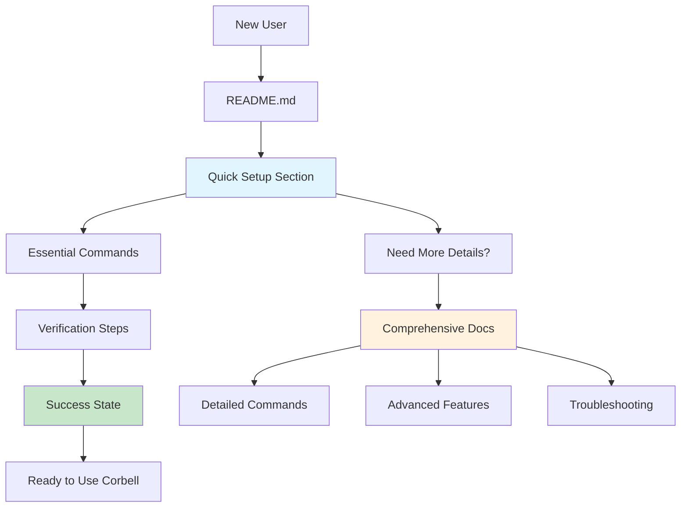
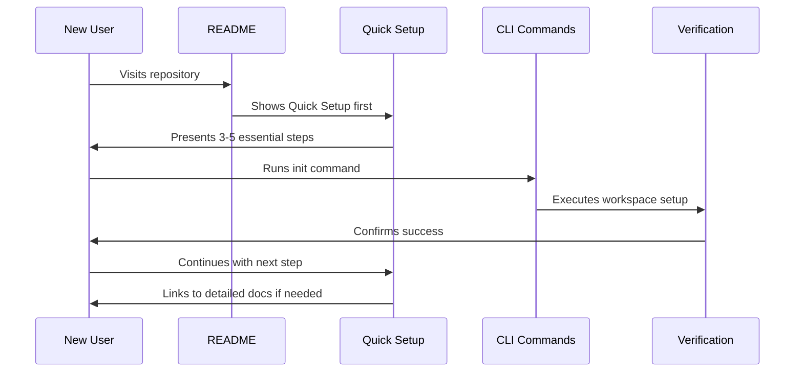
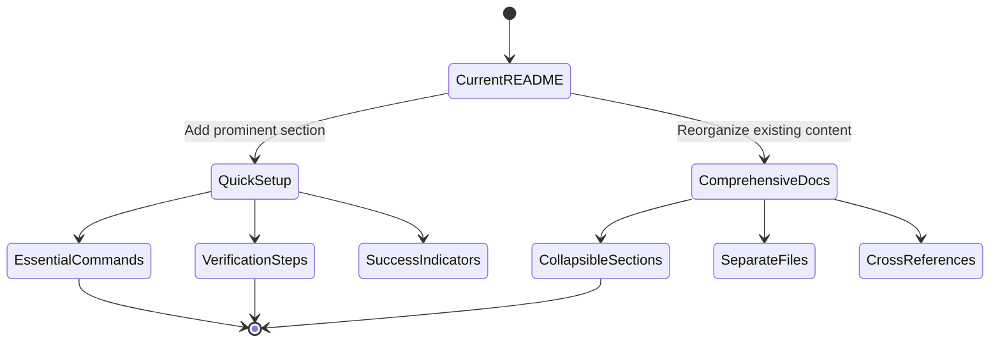

# Design Document: Simplified README Quick Setup Guide

## 1. Overview

### Problem Statement
The current README.md contains comprehensive documentation about all CLI commands and subcommands, which creates a barrier for new users who simply want to get started quickly. Users must navigate through detailed explanations of every feature when they only need basic setup instructions.

### Motivation
- Reduce time-to-first-success for new users
- Lower the cognitive load for developers who want to quickly evaluate or start using Corbell
- Maintain comprehensive documentation while providing a fast-track option
- Improve developer experience and adoption rates

### Success Criteria
- New users can complete basic setup in under 5 minutes
- Quick setup section is prominently placed and easily discoverable
- Comprehensive documentation remains accessible for power users
- Setup instructions work for 95% of common use cases

### Acceptance Criteria
- Quick setup section added to README with essential commands only
- Detailed documentation moved to expandable sections or separate files
- Setup verification steps included
- Links to comprehensive docs provided for advanced users

## 2. Current State

### Existing README Structure
The current README.md follows a comprehensive documentation approach with detailed explanations of every CLI command and subcommand. Based on the code context, the structure includes:

```
spec        Design spec lifecycle
  new         --feature --prd-file --prd --design-doc --existing --no-llm
  lint        Validate structure (--ci exits 1)
  review      Check spec vs graph → .review.md
  approve / decompose / context

export      notion | linear

ui          Architecture graph browser
  serve       --port (default 7433) --no-browser

mcp         Model Context Protocol server
  serve       stdio transport for Claude Desktop / Cursor

init        Create workspace.yaml
```

### Current Limitations
- Information overload for first-time users
- No clear entry point for quick evaluation
- Essential setup steps buried in comprehensive documentation
- No progressive disclosure of complexity
- Lack of guided onboarding experience

### User Journey Pain Points
1. Users land on README and see extensive command documentation
2. Unclear which commands are essential vs. optional
3. No clear sequence of steps for basic setup
4. Advanced features presented with same prominence as basics
5. No validation steps to confirm successful setup

## 3. Proposed Solution

### High-Level Approach
Implement a two-tier documentation structure:
1. **Quick Setup** - Essential commands and steps for immediate productivity
2. **Comprehensive Documentation** - Detailed explanations accessible via expandable sections or links

### Design Philosophy
- **Progressive Disclosure**: Start simple, reveal complexity on demand
- **Task-Oriented**: Focus on what users want to accomplish
- **Validation-Driven**: Include verification steps at each stage
- **Contextual Linking**: Provide pathways to detailed docs when needed

### Key Components

#### Quick Setup Section
- Minimal prerequisites
- 3-5 essential commands
- Verification steps
- Success indicators
- Links to detailed documentation

#### Restructured Comprehensive Documentation
- Collapsible sections for detailed command explanations
- Separate files for advanced topics
- Cross-references between quick and detailed docs

### System Context Diagram



### User Flow Sequence



## 4. Implementation Details

### README Structure Changes
The new README will follow this hierarchy:

1. **Project Description** (unchanged)
2. **🚀 Quick Setup** (new, prominent)
3. **📖 Full Documentation** (reorganized, collapsible)
4. **Advanced Topics** (moved to separate sections)

### Quick Setup Content Strategy
- Maximum 5 commands for basic functionality
- Each command includes purpose and expected output
- Verification step after each major command
- Clear success indicators
- Escape hatches to detailed documentation

### Content Reorganization Approach
- Move detailed command explanations to collapsible sections
- Create separate markdown files for complex topics
- Maintain all existing information (no content loss)
- Add cross-references and navigation aids

## 5. Code Integration and File Changes

### Corbell/README.md
**Current State:**
```
spec        Design spec lifecycle
  new         --feature --prd-file --prd --design-doc --existing --no-llm
  lint        Validate structure (--ci exits 1)
  review      Check spec vs graph → .review.md
  approve / decompose / context

export      notion | linear

ui          Architecture graph browser
  serve       --port (default 7433) --no-browser

mcp         Model Context Protocol server
  serve       stdio transport for Claude Desktop / Cursor

init        Create workspace.yaml
```

**Required Changes:**
The README will be restructured to add a Quick Setup section at the top, followed by reorganized comprehensive documentation. The existing command documentation will be preserved but moved to expandable sections.

### Corbell/corbell/cli/commands/spec.py
**Current State:**
```python
"""spec: CLI commands — generate, lint, review, approve, and decompose specs.

Key improvements in this version:
- spec new: No --service flag needed — services auto-discovered from PRD
- spec new: --existing mode for generating codebase design docs without any PRD
- spec new: --design-docs flag to feed existing design docs into LLM context
- All LLM commands: token usage tracked and displayed in a summary table
"""
```

**Required Changes:**
No code changes needed in this file. The CLI commands remain the same; only the documentation presentation changes. However, this file's docstring provides valuable context for which commands should be featured in the Quick Setup (likely `spec new` as the primary command).

### Corbell/corbell/core/spec/generator.py
**Current State:**
```python
"""Design document generator — the heart of Corbell.

Builds context from the graph, embeddings, and learned doc patterns,
then calls an LLM (OpenAI/Anthropic/AWS/Azure/GCP) to produce a full technical
design document in Markdown.

Key features:
- **Auto service discovery**: PRDProcessor discovers relevant services automatically
  via embedding similarity — no --service flag needed.
- **Existing codebase mode**: Generate a design doc without any PRD.
- **Design doc context**: Existing .md design
```

**Required Changes:**
No direct code changes needed. This file's docstring helps inform which features should be highlighted in the Quick Setup (auto service discovery is a key selling point that reduces complexity).

### Corbell/corbell/cli/commands/docs.py
**Current State:**
```python
store = DocPatternStore(config_dir / ".corbell" / "doc_patterns.json")
patterns = store.load()

if not patterns:
    console.print("[yellow]No patterns learned yet. Run `docs:scan` then `docs:learn`.[/yellow]")
    raise typer.Exit(0)

for pat in patterns:
    console.print(f"\n[bold cyan]{pat.source_file}[/bold cyan] ({pat.detected_type})")
    if pat.section_headings:
        console.print(f"  Sections: {', '.join(pat.section_headings[:5])}")
```

**Required Changes:**
No code changes needed. This file shows the `docs:scan` and `docs:learn` workflow, which might be included in the Quick Setup if document pattern learning is essential for basic functionality.

### Corbell/corbell/core/prd_processor.py
**Current State:**
```python
"""
These are sentence-form descriptions, not keyword lists — they embed far
closer to actual source code than keyword soup.

Args:
    prd_text: Full PRD / feature description text.

Returns:
    List of 1-4 sentence queries suitable for embedding similarity search.
"""
```

**Required Changes:**
No code changes needed. This file handles PRD processing internally and doesn't affect the README documentation structure.

### Corbell/corbell/core/embeddings/extractor.py
**Current State:**
```python
"""Code chunk extractor for embedding indexing.

Extracts code chunks (functions, classes, methods) from source files.
Extracts function/class/method chunks using Python ast; generic line-split for others.
"""
```

**Required Changes:**
No code changes needed. This is an internal component that doesn't impact user-facing documentation.

### Corbell/corbell/core/graph/builder.py
**Current State:**
```python
manifests = {"package.json", "requirements.txt", "go.mod", "pom.xml", "build.gradle"}
for fp in repo_path.rglob("*"):
    if not fp.is_file():
        continue
    if self._should_skip(fp):
        continue
    if fp.name in manifests:
        yield fp
        continue
    if _EXTENSION_LANG.get(fp.suffix) == language or fp.suffix in _EXTENSION_LANG:
        yield fp
```

**Required Changes:**
No code changes needed. This file shows the supported project types (Node.js, Python, Go, Java, Gradle), which information could be useful in the Quick Setup prerequisites section.

## 6. Detailed Implementation Plan

### Quick Setup Section Content

```markdown
## 🚀 Quick Setup (2 minutes)

### Prerequisites
- Python 3.8+ or Node.js 16+ or Go 1.19+ (based on your project)
- Git repository with source code

### Essential Steps

1. **Initialize Corbell workspace**
   ```bash
   corbell init
   ```
   ✅ Creates `workspace.yaml` in your project root

2. **Generate your first design document**
   ```bash
   corbell spec new --prd "Add user authentication feature"
   ```
   ✅ Creates design document with auto-discovered services

3. **View architecture graph** (optional)
   ```bash
   corbell ui serve
   ```
   ✅ Opens browser at http://localhost:7433

### Verify Setup
- [ ] `workspace.yaml` exists in your project
- [ ] Design document generated successfully
- [ ] Architecture graph loads (if using UI)

**Need more details?** See [Full Documentation](#full-documentation) below.
```

### Documentation Reorganization Strategy



## 7. Risks and Mitigations

### Technical Risks

**Risk: Information Architecture Confusion**
- *Description*: Users might miss important details when focusing only on Quick Setup
- *Mitigation*: Include strategic links to comprehensive documentation at decision points
- *Solution*: Add contextual "Learn more" links after each quick setup step

**Risk: Maintenance Overhead**
- *Description*: Maintaining both quick and comprehensive documentation could lead to inconsistencies
- *Mitigation*: Use single-source-of-truth approach with includes/references where possible
- *Solution*: Implement documentation review checklist that verifies both versions when making changes

**Risk: Quick Setup Becomes Outdated**
- *Description*: CLI commands or workflows might change, breaking the quick setup
- *Mitigation*: Include quick setup validation in CI/CD pipeline
- *Solution*: Create automated tests that verify quick setup commands work end-to-end

### User Experience Risks

**Risk: Over-Simplification**
- *Description*: Quick setup might not work for edge cases or complex projects
- *Mitigation*: Include troubleshooting section and clear escalation paths
- *Solution*: Add "If this doesn't work" sections with links to detailed troubleshooting

**Risk: Cognitive Overload Shift**
- *Description*: Users might still feel overwhelmed by the comprehensive documentation section
- *Mitigation*: Use progressive disclosure techniques (collapsible sections, separate pages)
- *Solution*: Implement task-based navigation that guides users to relevant sections

## 8. Testing and Validation

### User Testing Strategy
- **New User Testing**: Recruit 5-10 developers unfamiliar with Corbell
- **Time-to-Success Measurement**: Track time from README to first successful command
- **Comprehension Testing**: Verify users understand what each step accomplishes
- **Fallback Testing**: Ensure users can find detailed docs when needed

### Content Validation
- **Command Accuracy**: Verify all quick setup commands work in clean environments
- **Output Validation**: Confirm expected outputs match actual command results
- **Link Testing**: Ensure all cross-references and links work correctly
- **Mobile Responsiveness**: Test README rendering on mobile devices (GitHub mobile)

### Success Metrics
- Time to first successful `corbell spec new` command < 5 minutes
- 90% of test users complete quick setup without consulting detailed docs
- User satisfaction score > 4.0/5.0 for setup experience
- Reduction in setup-related GitHub issues by 50%

## 9. Deployment and Monitoring

### Deployment Strategy
1. **Content Creation**: Draft new README structure in feature branch
2. **Internal Review**: Team review of quick setup flow and content accuracy
3. **User Testing**: External validation with target user personas
4. **Iterative Refinement**: Incorporate feedback and test again
5. **Production Deployment**: Merge to main branch with monitoring

### Monitoring and Success Tracking
- **GitHub Analytics**: Track README engagement and scroll depth
- **Issue Analysis**: Monitor setup-related GitHub issues and discussions
- **User Feedback**: Collect feedback through GitHub discussions or surveys
- **Command Usage**: Track which commands are used most frequently after setup

### Key Metrics to Track
- README page views and engagement time
- Quick setup section interaction rates
- Conversion from README view to first command execution
- Support request volume related to setup issues
- User retention after successful quick setup

### Operational Considerations
- **Documentation Maintenance**: Assign ownership for keeping quick setup current
- **Feedback Loop**: Establish process for incorporating user feedback
- **Version Alignment**: Ensure quick setup stays aligned with CLI changes
- **Accessibility**: Maintain accessibility standards for all documentation

This design provides a clear path to simplify the README while maintaining comprehensive documentation, with specific implementation guidance and risk mitigation strategies based on the current codebase structure.